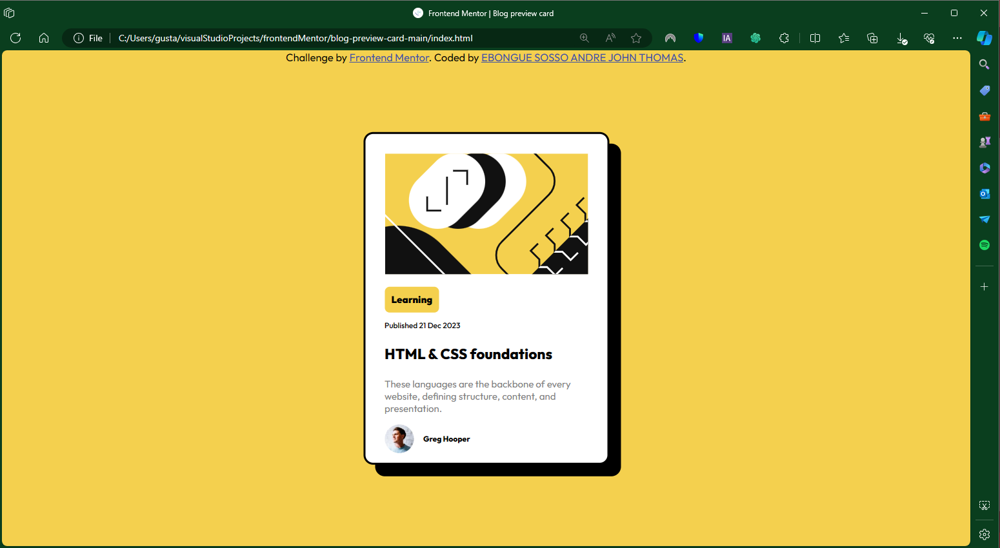

# Frontend Mentor - Blog preview card solution

This is a solution to the [Blog preview card challenge on Frontend Mentor](https://www.frontendmentor.io/challenges/blog-preview-card-ckPaj01IcS). Frontend Mentor challenges help you improve your coding skills by building realistic projects.

## Table of contents

div class="card": the main component of blog prewiew card
  img class="imagecard": the image of card
  button class="buttonlearning": the button for explore more detail about the blog
  p class="date": the date of publishement
  p class="title": the title of the blog card
  p class="description": A short description about the blog
  div class="user": Containe infos about the card owner (picture, username)

- [Frontend Mentor - Blog preview card solution](#frontend-mentor---blog-preview-card-solution)
  - [Table of contents](#table-of-contents)
  - [Overview](#overview)
    - [The challenge](#the-challenge)
    - [Screenshot](#screenshot)
    - [Links](#links)
  - [My process](#my-process)
    - [Built with](#built-with)
    - [What I learned](#what-i-learned)
    - [Continued development](#continued-development)
    - [Useful resources](#useful-resources)
  - [Author](#author)
  - [Acknowledgments](#acknowledgments)

## Overview

The blog preview component provide a short description about a main blog

### The challenge

Users should be able to:

- See hover and focus states for all interactive elements on the page

### Screenshot

Add a screenshot of your solution. The easiest way to do this is to use Firefox to view your project, right-click the page and select "Take a Screenshot". You can choose either a full-height screenshot or a cropped one based on how long the page is. If it's very long, it might be best to crop it.

Alternatively, you can use a tool like [FireShot](https://getfireshot.com/) to take the screenshot. FireShot has a free option, so you don't need to purchase it. 

Then crop/optimize/edit your image however you like, add it to your project, and update the file path in the image above.

### Links

- Solution URL: [Add solution URL here](https://thofelix6blog-preview-card-lovat-nine.vercel.app)

## My process

For this exercise I've used HTML5 and CSS3 programming language. For code it I've used VSCode as code editor and used git and github as version control. In this exercise we have a design folder in which there are some image about how the site have to look, the images folder in which there are all image needed for thsi exercise; the idex.html for creating all component and the style.css to add some style to our components.

### Built with

- HTML5
- CSS3

### What I learned

In this section, I've learned how to create a basic card with HTML5 and CSS3 language.

If you want more help with writing markdown, we'd recommend checking out [The Markdown Guide](https://www.markdownguide.org/) to learn more.

### Continued development

Use this section to outline areas that you want to continue focusing on in future projects. These could be concepts you're still not completely comfortable with or techniques you found useful that you want to refine and perfect.

### Useful resources

- [chenhuijing](https://chenhuijing.com/blog/css-card-shadow-effects/) - This helped me for add that kind of solid black shadow fot the card.

## Author

- Website - [EBONGUE SOSSO ANDRE JOHN THOMAS](https://thofelix6blog-preview-card-lovat-nine.vercel.app)
- Frontend Mentor - [@thofelix6](https://www.frontendmentor.io/profile/thofelix6)

## Acknowledgments

This is where you can give a hat tip to anyone who helped you out on this project. Perhaps you worked in a team or got some inspiration from someone else's solution. This is the perfect place to give them some credit.
